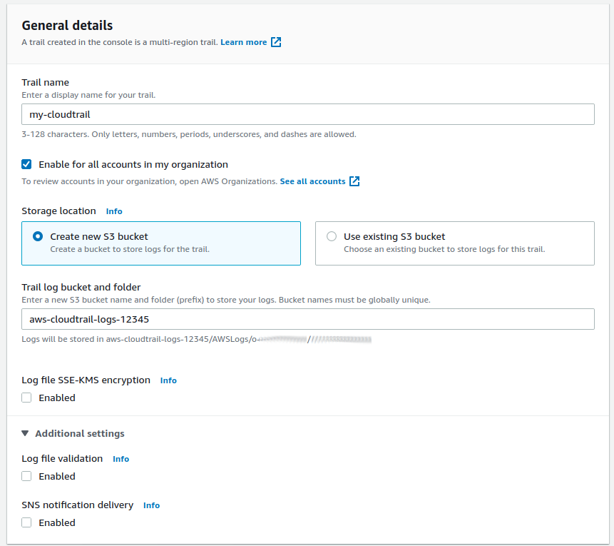

# Athena CloudTrail Partitioner

AWS Athena is a serverless query service that helps you query your unstructured S3 data without all the ETL.

Athena allows you to query your CloudTrail log data from your S3 bucket on demand. However, it can be challenging to maintain sensible partitioning on the database over time.

This project helps you periodically add partitions to your Athena/Glue database for each day/month/year/region/account added to your CloudTrail log bucket.

[Read more about why we built this, and how it can be used, in this blog post](https://www.gorillastack.com/news/cloudtrail-athena-query/).

## Prerequisites

### Enable CloudTrail

CloudTrail is an audit log of every action to occur in your AWS Action. It should be on all the time.

You can now [enable CloudTrail at the AWS Organization level](https://docs.aws.amazon.com/organizations/latest/userguide/services-that-can-integrate-ct.html), which means that CloudTrail for each account will be centrally logged and automatically enabled for all new accounts.

Currently for the CloudFormation template used in this project, CloudTrail must be enabled at an Organization level with no encryption and using no additional prefix in the S3 bucket.



Read the AWS documentation about how to [create your organization CloudTrail](https://docs.aws.amazon.com/awscloudtrail/latest/userguide/creating-trail-organization.html) here.

### S3 Bucket to Store Lambda Code

If you are not using the `ap-southeast-2` AWS region you will need to copy the Lambda deployment package ZIP file to an S3 bucket in your chosen region. For example:

```
aws s3 mb s3://myorganization-athena-cloudtrail-partitioner
aws s3 cp s3://gorillastack-autotag-releases/partitioner-0.1.0.zip s3://myorganization-athena-cloudtrail-partitioner
```

## Installation

Install the Athena CloudTrail Partitioner through CloudFormation, either through the AWS CLI:

```
aws cloudformation deploy \
  --stack-name athena-cloudtrail-partitioner \
  --region ${AWS_DEFAULT_REGION} \
  --template-file cf/template.yml \
  --force-upload \
  --parameter-overrides \
    "OrganizationId=${ORGANIZATION_ID}" \
    "S3BucketName=${S3_BUCKET_NAME}" \
    "CodeS3BucketName=${CODE_S3_BUCKET_NAME}" \
  --capabilities CAPABILITY_NAMED_IAM \
  --no-fail-on-empty-changeset
```

Where:
- `${AWS_DEFAULT_REGION}` is your chosen AWS Region
- `${ORGANIZATION_ID}` is your AWS Organization ID which [can be found here](https://console.aws.amazon.com/organizations/home?#/organization/settings)
- `${S3_BUCKET_NAME}` is the S3 bucket where your CloudTrail trail is stored
- `${CODE_S3_BUCKET_NAME}` is the S3 bucket where you have copied the Lambda Deployment bundle to (you can omit this if you are using `ap-southeast-2`)

Alternatively you can click this button to deploy through the AWS Console if you are using `ap-southeast-2`:

[](https://console.aws.amazon.com/cloudformation/home?region=ap-southeast-2#/stacks/quickcreate?stackName=athena-cloudtrail-partitioner&templateUrl=https%3A%2F%2Fgorillastack-cloudformation-templates.s3.amazonaws.com%2Fathena-cloudtrail-partitioner.yml)

